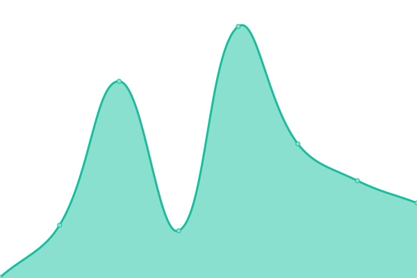

# [📈 Live Status](https://jpleasants.github.io/plesk2): <!--live status--> **🟩 All systems operational**

This repository contains the open-source uptime monitor and status page for [jpleasants](https://jpleasants.github.io/plesk2), powered by [Upptime](https://github.com/upptime/upptime).

With [Upptime](https://upptime.js.org), you can get your own unlimited and free uptime monitor and status page, powered entirely by a GitHub repository. We use [Issues](https://github.com/jpleasants/plesk2/issues) as incident reports, [Actions](https://github.com/jpleasants/plesk2/actions) as uptime monitors, and [Pages](https://jpleasants.github.io/plesk2) for the status page.

<!--start: status pages-->
<!-- This summary is generated by Upptime (https://github.com/upptime/upptime) -->
<!-- Do not edit this manually, your changes will be overwritten -->
<!-- prettier-ignore -->
| URL | Status | History | Response Time | Uptime |
| --- | ------ | ------- | ------------- | ------ |
|  [guruindiancuisine](https://guruindiancuisine.com) | 🟩 Up | [guruindiancuisine.yml](https://github.com/jpleasants/plesk2/commits/HEAD/history/guruindiancuisine.yml) | 

 129ms
     
 | 

<a href="https://jpleasants.github.io/plesk2/history/guruindiancuisine">100.00%</a>
    

|  [Plesk 2](https://plesk2.samitsolutions.com) | 🟩 Up | [plesk-2.yml](https://github.com/jpleasants/plesk2/commits/HEAD/history/plesk-2.yml) | 

 4019ms
     
 | 

<a href="https://jpleasants.github.io/plesk2/history/plesk-2">98.83%</a>
    

|  [imcs](https://imcs.sx) | 🟩 Up | [imcs.yml](https://github.com/jpleasants/plesk2/commits/HEAD/history/imcs.yml) | 

 1261ms
     
 | 

<a href="https://jpleasants.github.io/plesk2/history/imcs">99.45%</a>
    

|  [samanalyticsolutions](https://samanalyticsolutions.com) | 🟩 Up | [samanalyticsolutions.yml](https://github.com/jpleasants/plesk2/commits/HEAD/history/samanalyticsolutions.yml) | 

 135ms
     
 | 

<a href="https://jpleasants.github.io/plesk2/history/samanalyticsolutions">100.00%</a>
    

|  [asliceofthecloud](https://asliceofthecloud.com) | 🟩 Up | [asliceofthecloud.yml](https://github.com/jpleasants/plesk2/commits/HEAD/history/asliceofthecloud.yml) | 

 2919ms
     
 | 

<a href="https://jpleasants.github.io/plesk2/history/asliceofthecloud">99.20%</a>
    

|  [bikanerelectrical](https://bikanerelectrical.com) | 🟩 Up | [bikanerelectrical.yml](https://github.com/jpleasants/plesk2/commits/HEAD/history/bikanerelectrical.yml) | 

 4724ms
     
 | 

<a href="https://jpleasants.github.io/plesk2/history/bikanerelectrical">99.72%</a>
    

|  [Cary Endoscopy Center](https://caryendoscopycenter.com) | 🟩 Up | [cary-endoscopy-center.yml](https://github.com/jpleasants/plesk2/commits/HEAD/history/cary-endoscopy-center.yml) | 

 133ms
     
 | 

<a href="https://jpleasants.github.io/plesk2/history/cary-endoscopy-center">99.55%</a>
    

|  [Cary Internal Medicine](https://caryinternalmedicine.com) | 🟩 Up | [cary-internal-medicine.yml](https://github.com/jpleasants/plesk2/commits/HEAD/history/cary-internal-medicine.yml) | 

 1365ms
     
 | 

<a href="https://jpleasants.github.io/plesk2/history/cary-internal-medicine">99.73%</a>
    

|  [Center For Digestive Diseases](centerfordigestivediseases.com) | 🟩 Up | [center-for-digestive-diseases.yml](https://github.com/jpleasants/plesk2/commits/HEAD/history/center-for-digestive-diseases.yml) | 

 2830ms
     
 | 

<a href="https://jpleasants.github.io/plesk2/history/center-for-digestive-diseases">97.82%</a>
    

|  [directed-vr](https://directed-vr.com) | 🟩 Up | [directed-vr.yml](https://github.com/jpleasants/plesk2/commits/HEAD/history/directed-vr.yml) | 

 475ms
     
 | 

<a href="https://jpleasants.github.io/plesk2/history/directed-vr">99.31%</a>
    

|  [docnc](https://docnc.org) | 🟩 Up | [docnc.yml](https://github.com/jpleasants/plesk2/commits/HEAD/history/docnc.yml) | 

 795ms
     
 | 

<a href="https://jpleasants.github.io/plesk2/history/docnc">99.11%</a>
    

|  [hcilcode](https://hcilcode.com) | 🟩 Up | [hcilcode.yml](https://github.com/jpleasants/plesk2/commits/HEAD/history/hcilcode.yml) | 

 670ms
     
 | 

<a href="https://jpleasants.github.io/plesk2/history/hcilcode">100.00%</a>
    

|  [jalwaindianbistro](https://jalwaindianbistro.com) | 🟩 Up | [jalwaindianbistro.yml](https://github.com/jpleasants/plesk2/commits/HEAD/history/jalwaindianbistro.yml) | 

 178ms
     
 | 

<a href="https://jpleasants.github.io/plesk2/history/jalwaindianbistro">100.00%</a>
    

|  [prdbi](https://prdbi.com) | 🟩 Up | [prdbi.yml](https://github.com/jpleasants/plesk2/commits/HEAD/history/prdbi.yml) | 

 117ms
     
 | 

<a href="https://jpleasants.github.io/plesk2/history/prdbi">99.62%</a>
    

|  [prodigybiotech](https://prodigybiotech.com) | 🟩 Up | [prodigybiotech.yml](https://github.com/jpleasants/plesk2/commits/HEAD/history/prodigybiotech.yml) | 

 103ms
     
 | 

<a href="https://jpleasants.github.io/plesk2/history/prodigybiotech">100.00%</a>
    

|  [temoacloud](https://temoacloud.com) | 🟩 Up | [temoacloud.yml](https://github.com/jpleasants/plesk2/commits/HEAD/history/temoacloud.yml) | 

 864ms
     
 | 

<a href="https://jpleasants.github.io/plesk2/history/temoacloud">98.78%</a>
    

|  [rahul-priyadarshi](https://rahul-priyadarshi.net) | 🟩 Up | [rahul-priyadarshi.yml](https://github.com/jpleasants/plesk2/commits/HEAD/history/rahul-priyadarshi.yml) | 

 101ms
     
 | 

<a href="https://jpleasants.github.io/plesk2/history/rahul-priyadarshi">100.00%</a>
    

|  [tasteoftandoor](https://tasteoftandoor.com) | 🟩 Up | [tasteoftandoor.yml](https://github.com/jpleasants/plesk2/commits/HEAD/history/tasteoftandoor.yml) | 

 1187ms
     
 | 

<a href="https://jpleasants.github.io/plesk2/history/tasteoftandoor">98.79%</a>
    

|  [laysciences](https://laysciences.com) | 🟩 Up | [laysciences.yml](https://github.com/jpleasants/plesk2/commits/HEAD/history/laysciences.yml) | 

 3027ms
     
 | 

<a href="https://jpleasants.github.io/plesk2/history/laysciences">99.20%</a>
    

|  [Patagonia Health](https://patagoniahealth.com) | 🟩 Up | [patagonia-health.yml](https://github.com/jpleasants/plesk2/commits/HEAD/history/patagonia-health.yml) | 

 155ms
     
 | 

<a href="https://jpleasants.github.io/plesk2/history/patagonia-health">100.00%</a>
    

|  [thalirtp](https://thalirtp.com) | 🟩 Up | [thalirtp.yml](https://github.com/jpleasants/plesk2/commits/HEAD/history/thalirtp.yml) | 

 764ms
     
 | 

<a href="https://jpleasants.github.io/plesk2/history/thalirtp">100.00%</a>
    

|  [veearcapital](https://veearcapital.com) | 🟩 Up | [veearcapital.yml](https://github.com/jpleasants/plesk2/commits/HEAD/history/veearcapital.yml) | 

 114ms
     
 | 

<a href="https://jpleasants.github.io/plesk2/history/veearcapital">100.00%</a>
    

|  [kingstandoorandbar](https://kingstandoorandbar.com) | 🟩 Up | [kingstandoorandbar.yml](https://github.com/jpleasants/plesk2/commits/HEAD/history/kingstandoorandbar.yml) | 

 158ms
     
 | 

<a href="https://jpleasants.github.io/plesk2/history/kingstandoorandbar">100.00%</a>
    

|  [zaykaraleigh](https://zaykaraleigh.com) | 🟩 Up | [zaykaraleigh.yml](https://github.com/jpleasants/plesk2/commits/HEAD/history/zaykaraleigh.yml) | 

 967ms
     
 | 

<a href="https://jpleasants.github.io/plesk2/history/zaykaraleigh">99.60%</a>
    

|  [oceanbayindiancuisine](https://oceanbayindiancuisine.com) | 🟩 Up | [oceanbayindiancuisine.yml](https://github.com/jpleasants/plesk2/commits/HEAD/history/oceanbayindiancuisine.yml) | 

 3119ms
     
 | 

<a href="https://jpleasants.github.io/plesk2/history/oceanbayindiancuisine">99.15%</a>
    

<!--end: status pages-->

[**Visit our status website →**](https://jpleasants.github.io/plesk2)

## 📄 License

- Powered by: [Upptime](https://github.com/upptime/upptime)
- Code: [MIT](./LICENSE) © [jpleasants](https://jpleasants.github.io/plesk2)
- Data in the `./history` directory: [Open Database License](https://opendatacommons.org/licenses/odbl/1-0/)
